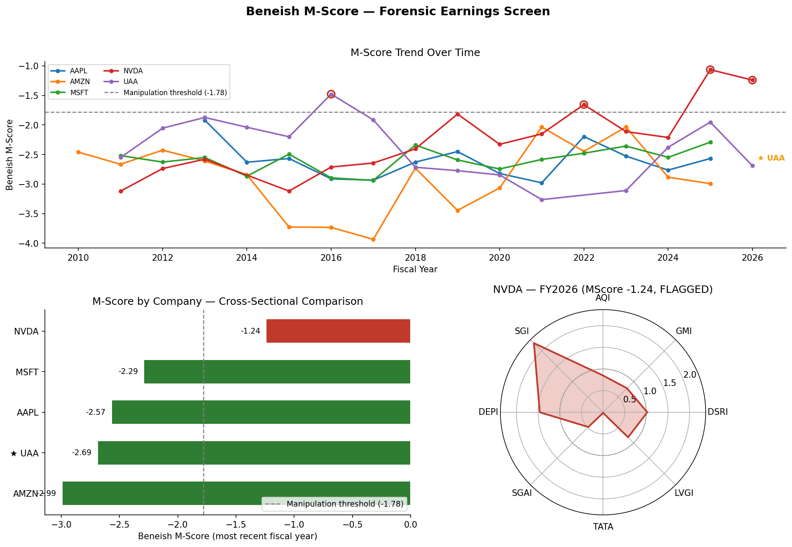

# Financial Statement Fraud Detector — Beneish M-Score Engine

**Forensic accounting screen for earnings manipulation using live SEC EDGAR data.**

## 1. Project Overview

Pulls 2+ years of 10-K financial statement data per ticker from SEC EDGAR's XBRL API, computes DSRI, GMI, AQI, SGI, DEPI, SGAI, LVGI, and TATA, combines them into a composite M-Score, flags likely earnings manipulators against both the fixed academic threshold and a sector-relative z-score, and visualizes results as a multi-year trend dashboard.

## 2. Real-World Finance Use Case

The Beneish M-Score is used informally by forensic accounting and internal audit teams, short-sellers and hedge funds sourcing ideas, and equity research analysts assessing earnings quality. It famously flagged Enron years before its collapse.

## 3. System Architecture

```
Tickers -> data_collection.py   (SEC EDGAR XBRL pull, normalize, validate, sector lookup)
        -> mscore_calculator.py (8-ratio Beneish M-Score, academic + sector-relative flagging)
        -> visualization.py     (trend line, comparison bar, radar, summary table, combined dashboard)
```

## 4 & 5. Required APIs, Data Sources, and Python Libraries

- **Data source:** SEC EDGAR XBRL `companyfacts` + `submissions` APIs (free, no key, requires a descriptive `User-Agent` with your email)
- **Libraries:** `pandas`, `numpy`, `requests`, `matplotlib` (all preinstalled in Colab)

## 6. Folder / File Structure

```
main_notebook.ipynb      Colab entry point, 15 sections
data_collection.py       SEC EDGAR pull, validation, sector lookup
mscore_calculator.py     8-ratio M-Score, academic + sector-relative flagging
visualization.py         trend line, comparison bar, radar, summary table, dashboard
README.md                this file
mscore_dashboard.png     generated on run — combined dashboard export
```

## 7. How to Run

1. Open `main_notebook.ipynb` in Google Colab.
2. Upload `data_collection.py`, `mscore_calculator.py`, `visualization.py` into the same Colab session (Files pane, left sidebar).
3. In the config cell, set `data_collection.USER_AGENT` to your real name + email (SEC requires this) and edit `TICKERS` to your basket.
4. Run all cells top to bottom.

## 8–14. Pipeline, Flagging, Validation, Dashboard, Metrics, Deliverables

See the notebook — each section is numbered to match this README and walks through the data pull, feature engineering, flagging (both thresholds), the known-fraud-case cross-check, the dashboard, and summary metrics in order.

**Resume line:** *Built a forensic earnings-quality screening tool applying the Beneish M-Score across 8 financial ratios to live SEC EDGAR data, with sector-relative outlier detection and automated accounting-identity validation — the same category of tool used by forensic accounting, short-selling, and equity research teams.*

---

## What Changed in This Version (v2)

The original build (v1) was functionally correct but flagged its own weaknesses honestly in its own writeup. This version closes three of them and adds the dashboard polish that was on the original upgrade list:

| # | Upgrade | What it does | Where |
|---|---|---|---|
| 1 | **Financial-statement cross-validation** | Checks `current_assets + ppe_net <= total_assets` and `revenue - cogs ≈ reported GrossProfit` (5% tolerance) on every pulled row. Doesn't drop bad rows — surfaces them in a `data_warnings` column so a bad pull is visible instead of silently corrupting a score. | `data_collection.validate_financials` |
| 2 | **Sector-relative thresholds** | Beneish's -1.78 cutoff was calibrated on a mostly-industrial, pre-2000 US sample and doesn't transfer cleanly to tech, financials, or non-US filers. Adds a within-sector z-score (grouped by 2-digit SIC code) as a *second*, complementary flag — "unusual for its industry" is a different and often more useful claim than "unusual vs. 1999 industrials." | `mscore_calculator.compute_sector_relative_flags` |
| 3 | **Restatement-aware extraction** | The v1 pull only looked at `form == "10-K"`, so a company restating a prior year via `10-K/A` would have its correction silently ignored. v2 prefers `10-K/A` over `10-K` for the same fiscal year, and takes the most-recently-*filed* value when SEC has multiple filings covering the same period. | `data_collection._extract_annual_series` |
| 4 | **Multi-year M-Score trend line** | The #1 item on the original upgrade list. Instead of only a latest-year snapshot, plots every company's M-Score across all available fiscal years, with flagged points ringed in red and known fraud-case tickers auto-starred. | `visualization.plot_mscore_trend` |
| 5 | **Automatic fraud-case annotation** | Every chart (trend, bar, radar) now automatically stars/labels any ticker present in `KNOWN_FRAUD_CASES` — no manual annotation step, and it stays correct as you add more cases. | `visualization.py`, throughout |
| 6 | **Folded-in summary table** | `summary_table()` now returns one row per company with flag status, sector z-score, data-quality warnings, and the known-fraud-case note all in the same table — the single artifact you'd hand someone as "the results." | `visualization.summary_table` |
| 7 | **Combined dashboard export** | `plot_dashboard()` renders trend + comparison bar + top-company radar as one figure, saved to `mscore_dashboard.png` — ready to drop into a resume portfolio or GitHub README without stitching three screenshots together. | `visualization.plot_dashboard` |

## Known Limitation Not Fully Closed: XBRL Segment/Dimension Filtering

The original writeup flagged that a multinational filer reporting `Revenues` at both consolidated and segment level under the same tag could have the extraction accidentally pull a segment value instead of the consolidated total. This is **not fully fixable** through SEC's `companyfacts` API — that endpoint intentionally simplifies away dimensional (segment/member) metadata; getting true dimension-aware filtering requires parsing the raw XBRL instance documents per filing, which is a materially larger project (a full XBRL taxonomy parser, not a tag-lookup). Documenting this limitation explicitly, rather than papering over it, is itself the defensible move for an interview — see the original v1 conversation notes for the full reasoning.

## Adding a New Historical Fraud Case

In `mscore_calculator.py`:

```python
KNOWN_FRAUD_CASES = {
    "ENRN": "Enron — 2001 accounting fraud, flagged retrospectively by the "
            "original Beneish model.",
    "WCOM": "WorldCom — 2002 expense capitalization fraud.",
    "UAA": "Under Armour — SEC settled 2021 over 'pull-forward' sales "
           "practices used to hit revenue targets, 2015-2016.",
    "TYC": "Tyco International — 2002 executive fraud and improper "
           "accounting for acquisitions.",   # <- add like this
}
```

Rules: ticker in quotes, colon, description in quotes, comma after every line except the last, same 4-space indent. The ticker also needs to be in your `TICKERS` list in the notebook, or it just won't appear in the pulled dataset to be annotated. Delisted/bankrupt companies (Enron, WorldCom, Tyco-era ticker) usually aren't in SEC's current ticker→CIK map — you'd need their CIK from EDGAR's full-text search and a direct-by-CIK fetch to pull their historical filings, which `data_collection.py` doesn't currently support standalone.

## Bugs / Weaknesses Still Present (Honest List)

- No `pytest` suite — validated via a synthetic smoke test in this sandbox (no live SEC network access here), not unit-tested against real edge cases (negative gross margin, zero prior-year revenue, missing years).
- Rate limiting is a flat `time.sleep(0.15)`, not adaptive backoff on SEC 429 responses.
- Sector grouping (2-digit SIC) is coarse — fine for a small ticker basket, too coarse for a large one where you'd want 4-digit SIC or a proper industry classification (GICS).
- `data_warnings` are heuristic tolerance checks (5%), not a full double-entry reconciliation.

## Three Further Upgrades (Not Yet Built)

1. Add Altman Z-Score and Piotroski F-Score, combine into one earnings-quality composite index alongside the M-Score.
2. Wrap in a Streamlit/Gradio app for interactive ticker lookup outside Colab.
3. SEC full-text search + a simple NLP pass over MD&A hedging language as a secondary, non-financial-statement signal.
